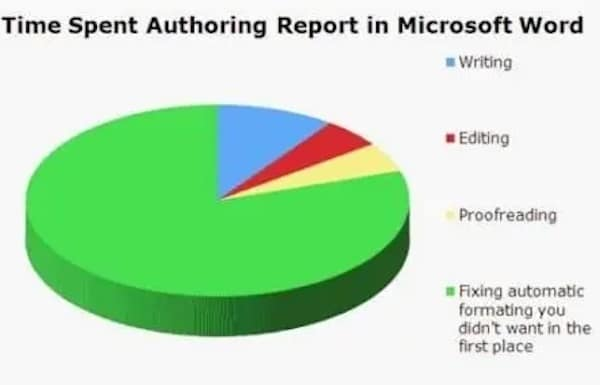
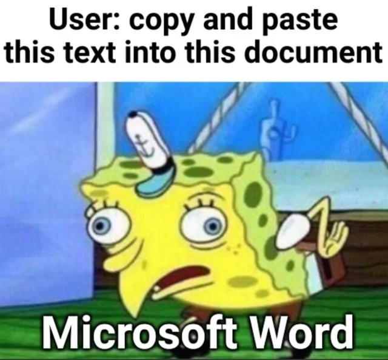
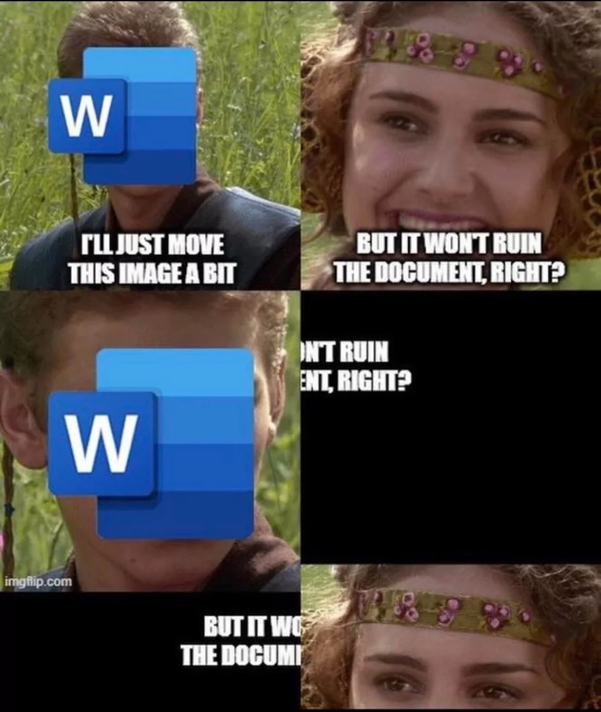
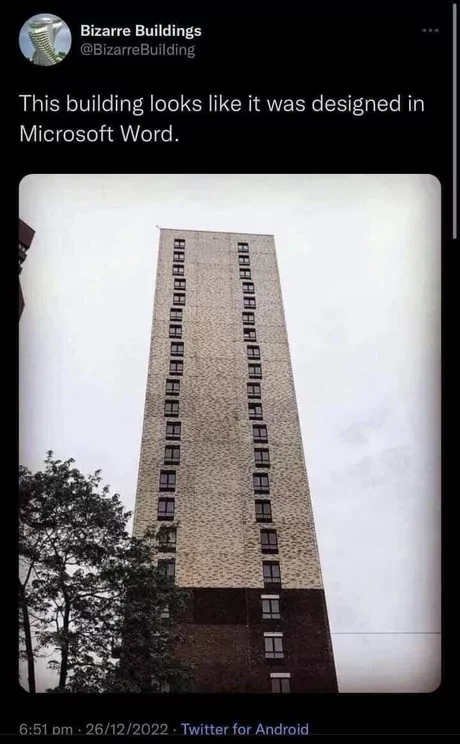

Cette page rassemble ce qui peut servir avant, pendant et après les séances. Elle s'enrichit au fil des ateliers et des échanges du [club](club.qmd) : n'hésitez pas à proposer des ajouts.

## Inspirations

- Le [Guide pratique d'artisanat numérique à l'Université](https://libruniv-c29483.frama.io/) de Christophe Masutti.
- Les premières saisons de [Déb/u/o/gue tes humanités](https://debugue.ecrituresnumeriques.ca/archives/).
- Les [cours](https://www.arthurperret.fr/cours/) d'Arthur Perret.
- Le manuel [*L'écriture académique au format texte avec Markdown et Pandoc*](https://e-publish.uliege.be/md2/) de Bernard Pochet.
- Le travail de [Julie Blanc](https://julie-blanc.fr/).
- Les éditions [abrüpt](https://abrupt.cc/).
- Les réflexions d'Antoine Fauchié sur [les fabriques de publication](https://www.quaternum.net/2020/04/29/les-fabriques-de-publication/).

## Tutoriels

### Par outil

- **Markdown et Zettlr** : [documentation de Zettlr](https://docs.zettlr.com)
- **Zotero** : [documentation de Zotero](https://www.zotero.org/support/)
- **Pandoc** : [manuel de Pandoc](https://pandoc.org/MANUAL.html)
- **Quarto** : [guide de Quarto](https://quarto.org/docs/guide/)
- **Stylo** : *à compléter (documentation de Stylo)*
- **LaTeX et Typst** : [documentation de Typst](https://typst.app/docs) ; *à compléter (LaTeX)*
- **HTML et CSS Print** : *à compléter*

### Fiches et pas-à-pas

- *À compléter : fiches rédigées pour les séances (installation, premiers pas, dépannage).*

## Exemples

Des documents réels pour voir à quoi ressemble un texte source et ce qu'il produit.

| Exemple | Source | Rendu |
|:--------|:-------|:------|
| L'affiche des ateliers (Markdown + CSS Print) | [affiche.qmd](https://github.com/ujubib/atelier-format-texte/blob/main/affiche.qmd) | [Affiche](affiche.qmd) |
| *À compléter : article, mémoire, diaporama…* | | |

Le [dépôt de ce site](https://github.com/ujubib/atelier-format-texte) est lui-même un exemple de projet Quarto complet.

## Modèles et gabarits

- *À compléter : modèles de mémoire ou de thèse, feuilles de style CSL, gabarits Pandoc ou Typst.*

## Pour aller plus loin

Des travaux de recherche qui pensent les formats, l'écriture et les chaînes de publication plutôt que les outils.

- Robin de Mourat, [*Le vacillement des formats. Matérialité, écriture et enquête\ : le design des publications en Sciences Humaines et Sociales*](http://www.these.robindemourat.com/), thèse de doctorat en Esthétique et Arts appliqués, Rennes 2, 2020. Disponible en ligne, en HTML, avec un glossaire consultable.
- [Julie Blanc](https://julie-blanc.fr/), thèse de doctorat en ergonomie et conception, Paris 8 / ArTeC (EnsadLab), sur l'usage des technologies web pour l'impression par les designers graphiques, 2025. *Lien vers le texte intégral à ajouter (theses.fr) — son site donne un aperçu de ses travaux.*
- Julie Blanc et Lucile Haute, *Standards du web et publication académique*, CodeX n°1, HYX, 2017. *Lien à ajouter.*
- *À compléter : autres articles, billets de blog, retours d'expérience.*

## Proposer une ressource

Une ressource à partager ? Écrivez à [julien.rabaud@univ-pau.fr](mailto:julien.rabaud@univ-pau.fr) ou ouvrez une proposition sur le dépôt.

## Humour

:::: {.callout-warning collapse="true"}
### memes

::: {layout="[[1,1], [1,1]]" style="padding:1em"}
{group="meme"}

{group="meme"}

{group="meme"}

{group="meme"}
:::

::::